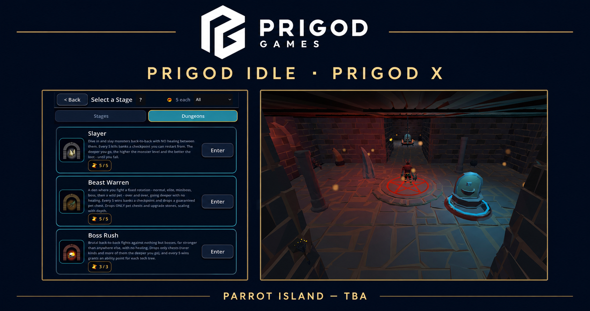

# Prigod Games

[](https://prigodgames.github.io/PrigodGames/)

Independent multiplayer adventures where every role matters.

## [Visit the Prigod Games website →](https://prigodgames.github.io/PrigodGames/)

Our debut title, **Project Overlord**, is an asymmetric multiplayer action game in development for PC. Five heroes enter a shifting dungeon while one player commands its monsters, traps, and hunger as the Overlord.

The website is published automatically through GitHub Pages from this repository.

## Local development

```bash
npm install
npm run dev
```

The production website source lives in `app/`; `index.html` is the static GitHub Pages entry point.
